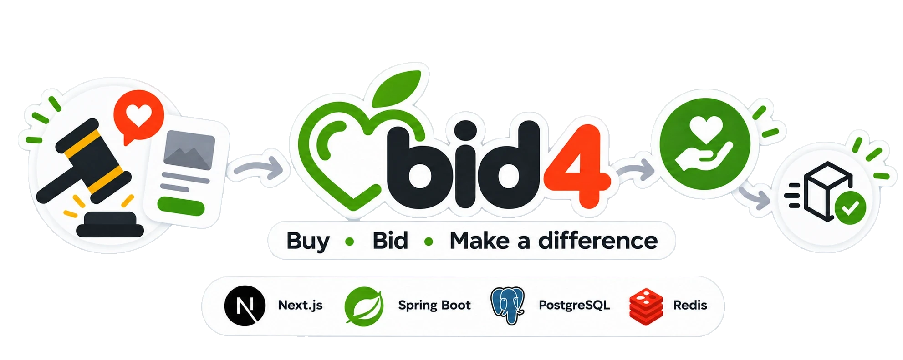
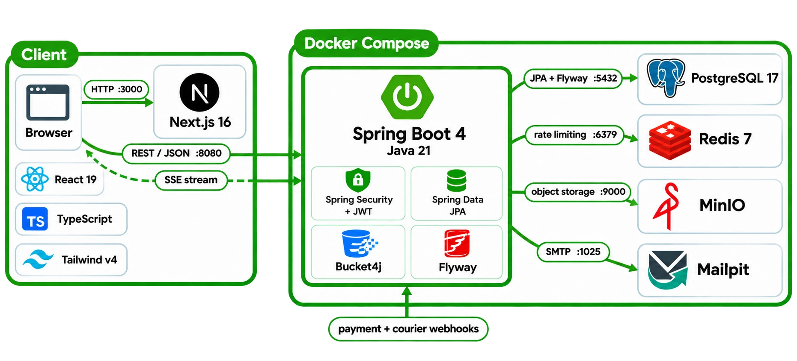

# 🍏 bid4

**bid4** is a Romanian charity auction platform. A seller lists an item, selects
a verified cause and sets the share of the sale price that goes to it, between
5% and 100%. Buyers make offers, the seller accepts one, and the payment is held
in escrow until the buyer confirms delivery. On release, the donation is
transferred to the cause, the remainder to the seller, and the platform retains
its fee.

The repository holds both halves of the product: a **Next.js 16** web
application and a **Spring Boot 4** API backed by PostgreSQL, Redis and MinIO.
The full local stack runs from a single `docker compose up`, and the web
application can also run standalone against a seeded in-browser data layer.

Status: the project is incomplete, and deliberately so in some places. The web
application is feature-complete against the seeded data layer. The API
implements most of the same contract but not all of it — cause submission and
operator review, password reset and account management have no endpoint yet,
and the web application covers them against the seeded dataset only. Payment,
delivery and email are stubbed behind interfaces rather than connected to live
providers, as set out under **Scope and simulated integrations** below.
[`ROADMAP.md`](ROADMAP.md) lists every gap and what closing it would take.

<p align="center">
  
</p>

---

## ✨ Features

**Listings and offers.** A listing carries the item, its photographs, the
selected cause and the donation share. Offers are measured against the asking
price rather than against each other, so a buyer is never required to outbid
anyone. There is no auction clock and no bid increment: a listing remains open
until its seller settles it.

**Several offers may be accepted; payment decides.** Each acceptance opens an
order awaiting payment, and the first buyer to complete payment takes the item.
That order becomes the sale, the listing is marked sold to that buyer, a
dispatch deadline is set for the seller, and every other unpaid order on the
listing is cancelled automatically with a notice posted into each conversation.
The rule is enforced in the database as well as in the service: a partial
unique index permits at most one order per listing in a paid state, so two
buyers paying at the same moment cannot both win. A payment arriving after the
listing has closed is refused and flagged for voiding.

**Escrow on a double-entry ledger.** Every movement of money is recorded as a
balanced transaction across six account kinds: member balance, cause balance,
platform escrow, platform revenue, platform shipping, and external. The ledger
rejects any movement whose sides do not sum to zero, and account balances are
reconcilable against the sum of their entries. Payment moves funds into escrow,
release splits them between seller and cause, and refunds reverse the movement.
All amounts are integer bani — `long` in Java, a branded `Bani` type in
TypeScript — with no floating-point arithmetic anywhere in the money path.

**Order lifecycle.** Orders progress through a fourteen-state machine covering
confirmation, payment, label generation, drop-off, transit, locker arrival and
delivery, with dispute, refund and cancellation as terminal branches. Each order
carries an event history, tracking events, a delivery snapshot taken at purchase
time, and the agreements both parties accepted. The buyer has 72 hours to
confirm delivery; easybox and courier shipping are both priced in.

**Billing documents.** Proformas, invoices, donation receipts, payout statements
and shipping labels are generated server-side, numbered per series and year, and
stored against the order.

**Causes and verification.** A cause is submitted with supporting documents and
reviewed by an operator before it can receive donations. Identity documents are
stored in a private bucket, separate from public imagery. The submission wizard
and the review queue are built in the web application; on the API `/causes` is
still read-only, so both run against the seeded dataset for now.

**Messaging.** Buyer and seller hold a per-listing conversation in which the
offer, its acceptance and the resulting order all take place. Live updates are
delivered over Server-Sent Events; because `EventSource` cannot send an
`Authorization` header, the client first exchanges its access token for a
single-use stream ticket and opens the stream with that.

**Authentication and sessions.** Registration with email confirmation (24-hour
token, 2-minute resend cooldown) and HS256 access tokens with a
15-minute lifetime held only in memory on the client. Refresh tokens rotate
inside a family recorded server-side, with a 30-day sliding lifetime and a
90-day absolute cap: presenting an already-rotated token is treated as theft and
revokes every session for that account. Access tokens carry a version claim
validated against the account, which is what will let a password change or a
global sign-out invalidate outstanding tokens within ten seconds without a
database read per request — the validator is in the filter chain, but neither
of the two endpoints that would raise the version exists yet. Failed logins
lock an account after five attempts for fifteen minutes.

**Media pipeline.** Photographs are decoded, re-encoded to WebP, resized and
EXIF-oriented in the browser before upload, with rotation and cropping applied
on a canvas. On the server the declared content type is discarded: the bytes are
probed for a JPEG, PNG or WebP signature, dimensions are read from the header,
and the file is stored in MinIO and served through an API route that can
authorise the reader rather than from a public bucket URL.

<p align="center">
  <br />
  
</p>

---

## 💶 How a sale settles

The buyer pays the item price, the platform fee and the delivery cost. The
seller's proceeds are never reduced by the platform fee — the only deduction
from the sale price is the donation the seller chose.

- **Platform fee** — 5% of the sale price plus a fixed 2.50 lei, paid by the buyer.
- **Delivery** — 14.99 lei to an easybox, 22.99 lei by courier, paid by the buyer.
- **Donation** — the share the seller set when listing, from 5% to 100% of the sale price.

A 200.00 lei sale with a 25% donation share, delivered to an easybox:

| Party            | Amount          | Derivation                          |
| ---------------- | --------------- | ----------------------------------- |
| Buyer pays       | **227.49 lei**  | 200.00 + 12.50 fee + 14.99 delivery |
| Cause receives   | **50.00 lei**   | 25% of 200.00                       |
| Seller receives  | **150.00 lei**  | 200.00 − 50.00                      |
| Platform retains | **12.50 lei**   | 5% of 200.00, plus 2.50             |
| Delivery         | **14.99 lei**   | held in the platform shipping account |

The split is computed identically on both sides — `lib/money.ts` in the browser
and `orders/service/Fees.java` on the server — and the resulting figures are
stored on the order, so a later change to the fee schedule cannot alter a
settled sale. The buyer's full payment enters platform escrow; release moves
the donation to the cause and the remainder to the seller.

---

## 🧭 Scope and simulated integrations

Three external services are defined as interfaces with stub implementations
rather than live integrations. Each is selected by configuration, so
introducing a provider means supplying an adapter, with no change to the
domain.

| Integration | Interface | Selected by | Implemented today |
| ----------- | --------- | ----------- | ----------------- |
| **Payment** | `PaymentGateway` | `bid4.payments.provider`, default `stub` | Checkout sessions, payment references, settlement and failure handling, and the escrow ledger entries. No payment provider is connected, and no card data exists anywhere in the system. |
| **Delivery** | `CourierGateway` | `bid4.shipping.provider`, default `stub` | Locker lookup, AWB issuance, label documents and tracking scans, all generated locally. Inbound webhooks are verified with HMAC-SHA256 and a constant-time comparison before they reach the order state machine, exactly as a carrier's would be. |
| **Email** | `JavaMailSender` over SMTP | `MAIL_HOST` / `MAIL_PORT`, default `localhost:1025` | A single message: the address-confirmation link. In development it is captured by Mailpit and never leaves the machine. No provider is configured for production, and there are no notification emails for offers, orders or delivery. |

The boundaries are explicit by design. The domain model, the ledger and the
order state machine are the substance of the project; each external service
sits behind an interface so a real provider can be introduced without touching
them.

---

## 🧱 Architecture

```
backend/               Spring Boot 4 API, packaged by feature rather than layer
  identity/            accounts, sessions, delivery and payment methods
  catalog/             listings, offers, settlement
  cause/               causes, verification, totals raised
  orders/              state machine, agreements, disputes, tracking
  ledger/              accounts, balanced transactions, balances
  billing/ payments/   documents and the payment surface
  shipping/ storage/   labels and tracking; uploads and media in MinIO
  inbox/               per-listing conversations over SSE
  ops/                 platform statistics
  common/ security/    errors, money, paging, audit; JWT, CORS, rate limiting
frontend/              Next.js 16 App Router, React 19, TypeScript, Tailwind v4
  src/app/             routes, in Romanian: /licitatii, /cauze, /cont/...
  src/components/      ui/ design system, layout/, auctions/, causes/, orders/
  src/lib/api/         the single data seam the UI imports from
  src/lib/mock/        the seeded dataset it runs on without a backend
docker-compose.yml     the local stack; the API sits behind a compose profile
```

The HTTP contract is defined by the client: each function in
`frontend/src/lib/api/*` names the endpoint it calls, and the API implements
that contract and no more. UI code imports from `lib/api` exclusively, never
from `lib/mock`, which is what allows `NEXT_PUBLIC_USE_MOCK` to replace the
entire data layer without a component change.

| Service    | Purpose                                            | Published on     |
| ---------- | -------------------------------------------------- | ---------------- |
| `postgres` | System of record                                   | `127.0.0.1:5432` |
| `redis`    | Rate limiting, login throttling, short-lived state | `127.0.0.1:6379` |
| `minio`    | Object storage: imagery and identity documents     | `127.0.0.1:9000` |
| `mailpit`  | Captures outbound mail in development               | `127.0.0.1:8025` |
| `backend`  | The API, behind the `app` profile                  | `127.0.0.1:8080` |

Every published port is bound to `127.0.0.1`, so the datastores are reachable
from the host and the compose network but never from the LAN. All services run
with `no-new-privileges`. Actuator is served on port 8081, which compose does
not publish, placing health and metrics out of reach by construction rather than
by access control.

### Enforced boundaries

Five ArchUnit rules run as part of the test suite and fail the build:

| Rule | Rationale |
| ---- | --------- |
| Controllers must not depend on repositories | A controller that queries directly is a service that cannot be reused or tested |
| `common` must not depend on any feature package | The shared floor cannot know what is built on it |
| Repositories must be interfaces | Spring Data supplies the implementation |
| Controllers must not depend on domain entities | Controllers speak DTOs, so no request can bind onto a table row |
| No field injection | Constructor injection turns a missing dependency into a compile error |

<p align="center">
  <br />
  
</p>

The request path, schema conventions and the reasoning behind each decision are
documented in [`backend/ARCHITECTURE.md`](backend/ARCHITECTURE.md).

---

## 🛠️ Tech stack


Also in use: Testcontainers and ArchUnit for the backend test suite, Bucket4j
over Lettuce for distributed rate limiting, the OWASP Java HTML Sanitizer on
every write, Spring Security's OAuth2 resource server for JWT validation,
Spotless and ESLint as style gates, and Trivy for dependency and secret
scanning in CI.
On the client: SWR for data fetching with per-viewer cache keys, Zod for
boundary validation, jsPDF for locally rendered documents, and JSON-LD for
structured data alongside generated `sitemap.ts` and `robots.ts`.

---

## 🚀 Local setup

Requires Docker Desktop, JDK 21 and pnpm.

### 1. Clone and configure

```bash
git clone https://github.com/alecs007/bid4.git
cd bid4
cp .env.example .env
```

Every value in `.env.example` is a placeholder. The JWT secret requires real
entropy:

```bash
openssl rand -base64 48
```

### 2. Start the infrastructure

```bash
docker compose up -d
```

Starts PostgreSQL, Redis, MinIO and Mailpit. The API is excluded by default — it
sits behind a compose profile so the common case stays fast.

### 3. Run the API

```bash
cd backend && ./mvnw spring-boot:run
```

The application reads the repository-root `.env` itself, so an IDE run
configuration needs no additional setup: open `backend/pom.xml` as a project and
run `BackendApplication`.

- API: `http://localhost:8080`, served from the root — `POST /auth/login`
- Health: `http://localhost:8081/actuator/health`

### 4. Run the web application

```bash
cd frontend && pnpm install && pnpm dev
```

Available at `http://localhost:3000`. It starts against the seeded data layer;
set `NEXT_PUBLIC_USE_MOCK=false` in `frontend/.env.local` to call the API.

### Full stack in containers

```bash
docker compose --profile app up -d --build
```

Slower, since the image builds with Maven from scratch. Appropriate before a
deployment rather than during development.

---

## ⚙️ Configuration

Infrastructure and API secrets are read from `.env` at the repository root,
which is gitignored. The template is [`.env.example`](.env.example).

| Variable                              | Required | Purpose                                        |
| ------------------------------------- | -------- | ---------------------------------------------- |
| `POSTGRES_DB` / `_USER` / `_PASSWORD` | yes      | System of record                               |
| `REDIS_PASSWORD`                      | yes      | Rate limiting and short-lived state            |
| `MINIO_ROOT_USER` / `_PASSWORD`       | yes      | Object storage credentials                     |
| `MINIO_BUCKET_PUBLIC` / `_PRIVATE`    | yes      | Public imagery and identity documents, separated |
| `BID4_JWT_SECRET`                     | yes      | HMAC key for access tokens; ≥ 32 bytes, base64 |
| `BID4_CORS_ORIGINS`                   | yes      | Origins permitted to call the API              |

The web application reads its own configuration from `frontend/.env.local`
([template](frontend/.env.example)):

| Variable                     | Purpose                                                    |
| ---------------------------- | ---------------------------------------------------------- |
| `NEXT_PUBLIC_USE_MOCK`       | `true` serves the seeded dataset, `false` calls the API     |
| `NEXT_PUBLIC_API_BASE`       | API origin, used when the mock layer is disabled            |
| `NEXT_PUBLIC_SHOW_DEV_TOOLS` | Seed-account sign-in panel; never rendered in production    |
| `NEXT_PUBLIC_SITE_URL`       | Public origin, used for canonical URLs and social cards     |

Platform behaviour is configured under the `bid4.*` tree in
`application.yaml` and bound to a validated record
(`common/config/Bid4Properties.java`), so an invalid value fails startup rather
than the first request that depends on it.

| Setting                        | Default            |
| ------------------------------ | ------------------ |
| Access token lifetime          | 15 minutes         |
| Refresh token lifetime         | 30 days sliding, 90 days absolute |
| Email verification token       | 24 hours, 2-minute resend cooldown |
| Account lockout                | 5 failed logins, 15 minutes |
| Rate limit — authentication    | 10 requests / 15 minutes, fails closed |
| Rate limit — refresh           | 60 requests / 5 minutes |
| Rate limit — writes            | 60 requests / minute |
| Rate limit — reads             | 300 requests / minute |

---

## 👥 Demo accounts

The `dev` profile seeds the four accounts the mock dataset already uses:

```bash
cd backend && ./mvnw spring-boot:run -Dspring-boot.run.profiles=dev
```

| Address             | Role       | Type         |
| ------------------- | ---------- | ------------ |
| `maria@bid4.ro`     | `USER`     | individual   |
| `contact@zambet.ro` | `USER`     | organisation |
| `operator@bid4.ro`  | `OPERATOR` | individual   |
| `admin@bid4.ro`     | `ADMIN`    | individual   |

All four use the password `bid4demo` and are pre-confirmed. Seeding requires
`bid4.dev.seed=true`, which only the `dev` profile sets, and aborts if the
database already contains users.

Accounts registered manually must confirm their address first. In development
all outbound mail is captured by Mailpit at `http://127.0.0.1:8025` and is never
delivered externally.

---

## 🧪 Testing and CI

```bash
cd backend && ./mvnw verify
```

Spotless runs first, then 175 tests across 18 classes: endpoint tests per
feature, the refresh-token exchange and lifetime, rate limiting, cache headers,
the order flow, ledger balancing, courier webhooks, and the five ArchUnit rules.
Testcontainers provisions real PostgreSQL, Redis and MinIO instances, so Flyway
applies all 17 migrations on every run and a broken migration fails the build
rather than a deployment. Docker must be running.

```bash
cd frontend
pnpm exec next typegen      # PageProps and LayoutProps are generated
pnpm exec tsc --noEmit
pnpm exec eslint src --max-warnings=0
pnpm exec vitest run
pnpm exec next build
```

`next typegen` must run first: the generated route types are emitted to
`.next/types`, which `tsconfig.json` includes, and on a clean checkout the
typecheck cannot resolve them otherwise. The lint budget is zero warnings — a
warning is either fixed or silenced at its line with a stated reason.

Three workflows run these checks, each with read-only token permissions and a
cancel-in-progress concurrency group:

| Workflow       | What it runs                                                              |
| -------------- | ------------------------------------------------------------------------- |
| `backend.yml`  | `mvnw verify` with Testcontainers, plus a Buildx build of the API image that is never pushed, so a broken Dockerfile is caught before deployment |
| `frontend.yml` | Frozen-lockfile install, typegen, typecheck, lint, tests, production build |
| `security.yml` | Trivy filesystem scan for known-fixed CVEs in `pom.xml` and `pnpm-lock.yaml` and for committed secrets, on every push and weekly |

---

## 🔒 Security

- **Deny by default.** The filter chain is stateless and opts endpoints in
  explicitly; every other route requires authentication. CSRF protection is
  disabled deliberately, because no request is authorised by ambient cookie
  credentials: the only cookie carrying authority is the refresh token, which
  is redeemed at a single endpoint.
- **Authorisation is the API's responsibility.** The web application's
  middleware only decides which page to render first; a forged role cookie
  produces a page whose data the API then refuses.
- **Token handling.** Access tokens are held in memory and never written to
  `localStorage`. The refresh cookie is `HttpOnly`, `Secure` and
  `SameSite=Strict`, and rotates within a server-side family; presenting a
  rotated token revokes every session for that account.
- **Rate limiting.** Four Bucket4j budgets in Redis, applied per caller. The
  authentication budget fails closed: if Redis is unavailable, authentication
  requests are rejected rather than allowed through.
- **Input handling.** Markup is stripped and Unicode normalised on write by the
  OWASP sanitizer, rather than escaped on read. All persistence goes through
  Spring Data with bound parameters.
- **Upload validation.** Content type is determined by probing the bytes for a
  JPEG, PNG or WebP signature and reading the dimensions from the header; the
  client's declared type is discarded. Public imagery and identity documents are
  stored in separate buckets and served through an authorising API route.
- **Response headers.** Content Security Policy, `X-Content-Type-Options`,
  `X-Frame-Options: DENY`, `Referrer-Policy: strict-origin-when-cross-origin`
  and a `Permissions-Policy` granting no hardware, set on both halves.
  `script-src` still includes `unsafe-inline`, which Next.js hydration requires
  until a per-request nonce replaces it; the directives that do not depend on
  script injection — `frame-ancestors`, `base-uri`, `form-action`, `object-src`
  — are enforced.
- **Webhook authenticity.** Payment and courier callbacks are authenticated
  with an HMAC-SHA256 signature over the raw body, compared in constant time,
  and an unsigned or mismatched callback is rejected before any order
  transition is applied.
- **Uniform error contract.** A single `ErrorCode` enumeration,
  `ApiErrorResponse` shape and global exception handler, so no stack trace
  reaches a client and the web application has exactly one response shape to
  parse. Every response carries an `X-Request-Id` that also appears in the
  server log.
- **Redirect safety.** `safeRedirect` resolves a `?redirect=` parameter against
  a probe origin and accepts it only if it resolves to the same one; prefix
  matching is insufficient, because browsers normalise `/\` to `//`.
- **No secrets in the repository.** All configuration comes from environment
  variables, `.env` files are gitignored, and CI scans every push for
  credentials that reached the tree.

Payment is simulated and a nonce-based CSP is not yet in place. Vulnerability
reports are handled through [SECURITY.md](SECURITY.md).

---

## 🩺 Troubleshooting

| ⚠️ Problem                                              | 🛠️ Resolution                                                                            |
| -------------------------------------------------------- | ----------------------------------------------------------------------------------------- |
| 🐳 `./mvnw verify` cannot start a container              | Testcontainers requires a running Docker daemon. Start Docker Desktop and retry.            |
| 🔌 The API starts but the browser is refused             | `BID4_CORS_ORIGINS` must list the web application origin, `http://localhost:3000` locally.  |
| 🔑 `BID4_JWT_SECRET` rejected at startup                 | The key must be at least 32 bytes, base64-encoded: `openssl rand -base64 48`.               |
| 🧭 The web app shows data the API never returned          | It is still using the mock layer. Set `NEXT_PUBLIC_USE_MOCK=false` in `frontend/.env.local`. |
| 📭 Registration succeeds but no mail arrives             | Development mail is captured by Mailpit at `http://127.0.0.1:8025`.                         |
| 🚫 Authentication rejected with "too many attempts"      | Rate limiting or account lockout. Wait out the stated interval, or clear the `ratelimit:*` keys in Redis. |
| 🧩 `tsc` cannot resolve `PageProps` or `LayoutProps`     | Run `pnpm exec next typegen` first; both are generated into `.next/types`.                  |
| 🗃️ A migration fails at startup after a schema change    | Flyway is forward-only. Add a new `V*.sql` rather than editing one that has already run.    |
| 🔁 Port already in use: 3000, 5432, 6379, 8080, 9000     | Stop the process holding it, or change the mapping in `docker-compose.yml`.                 |

---

## 📚 Documentation

- [`backend/ARCHITECTURE.md`](backend/ARCHITECTURE.md) — runtime topology, package layout, where each control sits, migration policy, decision log
- [`frontend/README.md`](frontend/README.md) — the web application, its security surface and the data seam
- [`CONTRIBUTING.md`](CONTRIBUTING.md) — setup, the checks CI runs, pull-request guidelines
- [`SECURITY.md`](SECURITY.md) — vulnerability reporting and scope
- [`ROADMAP.md`](ROADMAP.md) — what is stubbed, what is missing, and what each would take
- [`docs/CREDITS.md`](docs/CREDITS.md) — the licence of every third-party image in the tree

---

## 📐 Conventions

User-facing copy is Romanian; code, comments and identifiers are English.
Monetary amounts are integer bani on both sides of the wire — `lib/money.ts` and
`long` — and never a floating-point type. The backend is packaged by feature, so
a change to causes is contained to one directory. Migrations are forward-only:
the schema is defined in `db/migration/`, not derived from Hibernate. Comments
are reserved for what the code cannot state itself.

---

## 🤝 Contributing

Contributions are welcome — see [CONTRIBUTING.md](CONTRIBUTING.md) for setup,
the checks CI runs, and pull-request guidelines. For security issues, please
follow [SECURITY.md](SECURITY.md) rather than opening a public issue.

---

## 📄 License

The source code is released under the [MIT License](LICENSE).

The imagery is a separate matter. The seeded demo dataset ships 58 photographs
from Wikimedia Commons under Creative Commons terms, 35 of them share-alike,
and MIT cannot relicense them. Each file is credited with its author, source
and licence in [`docs/CREDITS.md`](docs/CREDITS.md), generated from the
`CREDITS.json` files held beside the images. If you are reusing the project
rather than reading it, replace that imagery with your own — nothing in the
domain depends on it.
